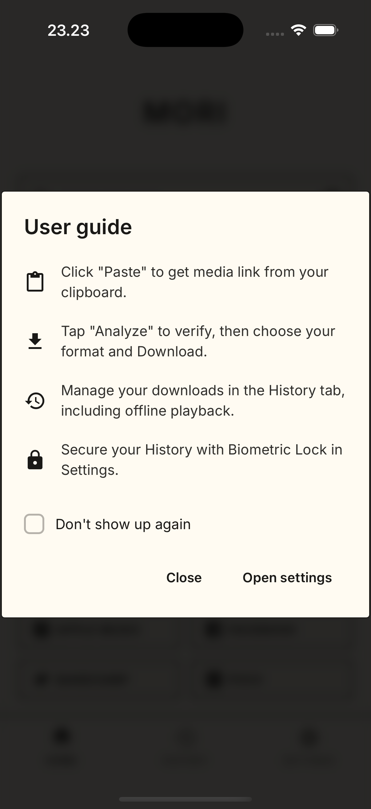
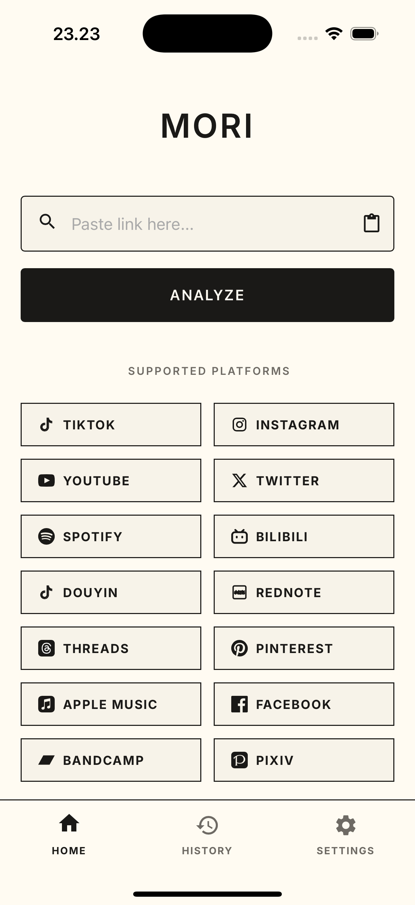
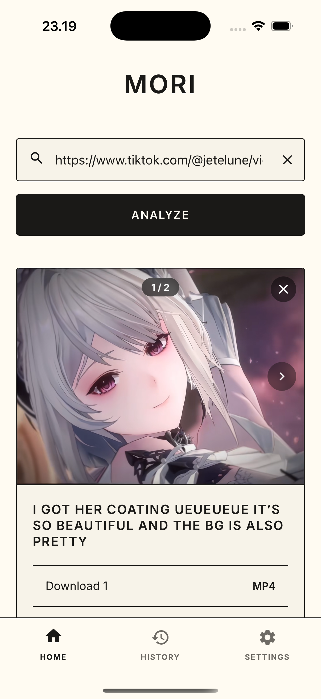
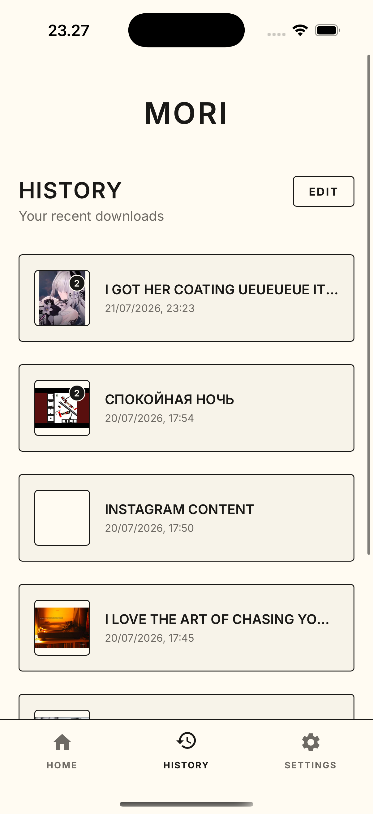
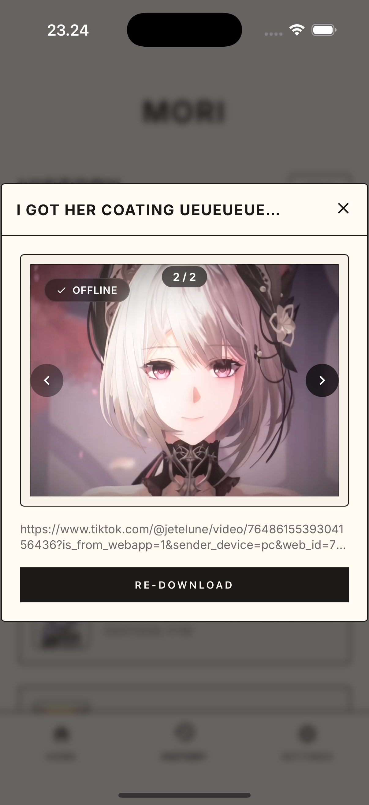
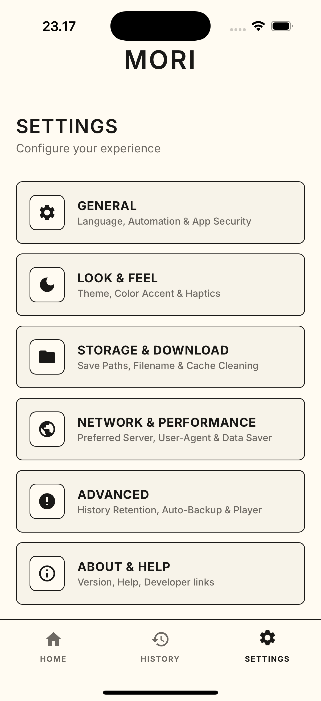

<p align="center">
  
</p>

<h1 align="center">Mori</h1>

<p align="center">
  
  
  
  
  
  
</p>

<div align="center">

Mori is a modern, privacy-first media downloader that saves photos, videos, and audio from 14 platforms. Built with a **client-only architecture**, all scraping runs on-device — no backend, no tracking, maximum privacy.

</div>

## 📸 Screenshots

<p align="center">
  
  
  
</p>
<p align="center">
  
  
  
</p>

## What's New in v4.0.0

- **iOS Support (Capacitor)**: Mori now runs on iOS! Added full Xcode project structure, iOS-native Capacitor plugins, and platform-agnostic file system handling via `@capacitor/filesystem`.
- **Reorganized 5-Tier Settings Suite**: Restructured all app settings into 5 perfectly categorized sub-pages: **General** (Language, Auto-Paste, Auto-Analyze, Privacy Lock, Lock Type, Incognito, Keep Screen Awake, Auto Check Updates, Auto-Clear Input, Auto-Download Link, Auto-Retry), **Storage & Download** (Video & Music Paths, Platform Subfolders, Filename Template, Total Media Size, Clear Cache, Wipe All Data), **Look & Feel** (Dark Mode, Color Accent, App Fonts, Vibration, Completion Sound, Header Quote, Home Greeting, Footer Tagline), **Network & Performance** (Preferred Server, User-Agent Mode, Request Timeout, Wi-Fi Only, Force IPv4, Anti-403 Header Guard, Cellular Data Warning, Bypass SSL Errors, Server Latency Diagnostics, Data Saver Mode), and **Advanced** (History Limits, Time-based Retention, Scheduled Auto-Backup, Auto-Play Media, Auto-Loop Media, Data Import/Export).
- **Dedicated Network & Performance Sub-page**: Added a brand-new 5th settings section featuring Preferred Server selection (Always Ask, Server 1 Primary, Server 2 Backup), User-Agent switching (Default Scraper, Mobile Chrome, iOS Safari, Desktop Chrome), configurable request timeout limits (15s–120s), Anti-403 header spoofing, cellular warning guard, SSL error bypassing, Data Saver mode, and an interactive real-time server latency ping diagnostic tool.
- **Universal Tactile Haptic Feedback**: Integrated native `@capacitor/haptics` with fallback direct motor vibration (`VIBRATE` permission) across all interactive elements (Buttons, Bottom Navigation Tabs, Toggle Switches, Dropdown options, and Chips) for immediate tactile touch response.
- **Hardened Biometric Privacy Lock**: Upgraded biometric protection engine to secure both **History** and **Settings** tabs. Features real-time state synchronization (instant re-locking upon toggle ON), mandatory authentication before modifying security settings, and automatic background re-locking (`appStateChange` listener).
- **Keep Screen Awake & Auto-Check Updates**: Integrated Web `Screen Wake Lock` API to prevent device screen sleep during heavy media downloads, and added an automated GitHub release check engine on startup in **General** settings.
- **Download Completion Sound (Crisp Bell Chime)**: High-pitch Web Audio API triangle-wave chime feedback upon successful download completion, fully offline without extra media assets.
- **Smart Auto-Retry Engine**: Automatic background retry mechanism for media downloads encountering network glitches or HTTP timeouts, attempting up to 3 automatic retries with status toast updates.
- **Minimalist Header, Quote, Greeting & Footer Customization**: Added independent toggles in **Look & Feel** to hide/show top header quote, home greeting banner, and footer tagline ("Simplicity is the ultimate sophistication") for ultra-clean UI personalization.
- **Synchronized Video Player Controls**: Custom MoriPlayer automatically synchronizes native `video.onplay` and `video.onpause` events so play/pause control icons reflect true playback status instantly on autoplay.
- **Scheduled Auto-Backup Data**: Configurable automatic data backup interval (Off, Weekly, Monthly) that exports user history and configuration settings to local JSON backups.
- **Time-Based Auto-Clear Cache & History Retention**: Upgraded both Auto-Clear Cache and Auto-Clear History settings from simple binary toggles to fully configurable retention menus (**Off, 1, 7, 30, 90 Days**), automatically purging old thumbnail caches and expired history items.
- **SnapTik TikTok Photo Slideshow Patch**: Fixed Object-URL data structure changes from SnapTik API (Server 2 TikTok), enabling robust photo slide extraction and UI rendering without crashes.
- **Safe JSON Response Parsing**: Added defensive `parseJsonResponse` error handling to catch HTML responses (Cloudflare/Rate Limits) from scraper servers gracefully instead of throwing raw JSON syntax errors.
- **Cross-Platform Parity**: All 14 platform scrapers work identically on iOS & Android. Shared codebase — one code, two platforms.
- **iOS-Specific Fixes & Media Preview**: Resolved local file path resolution for iOS WKWebView preview modals using `Filesystem.getUri()` and `Capacitor.convertFileSrc()`, with fallback image support and inline video playback flags (`playsinline`) to prevent infinite loading spinners.
- **Enhanced History Item Deletion UX**: Expanded touch target area for the red deletion ("X") button (`32px x 32px`, `z-index: 10`) and enabled full card click-to-delete in edit mode for seamless item removal.
- **Accessibility (A11y) & UI Consistency**: Added `aria-label` attributes across all icon-only buttons for full screen reader support. Standardized the Language settings to match the global custom dropdown component design.
- **Native Save to Gallery**: Integrated `@capacitor-community/media` to automatically save downloaded videos and photos directly to the iOS Camera Roll and Android Gallery, bypassing the need for manual file manager exports.
- **Code Optimization**: Extracted hardcoded inline CSS into dedicated stylesheet classes and removed deprecated legacy dropdown logic, reducing code bloat and improving maintainability.

## Previous Updates v3.9.0

- **Enhanced Filename Sanitization & Storage Permission Error Fix**:
  - **URI & Hashtag Sanitization**: Strips `#` (hashtags), `%`, `&`, and special symbols from video/media titles. Hashtags in filenames were previously causing Android native URI parsers to fail with `EACCES (Permission denied)` and `ENOENT (No such file or directory)`.
  - **Length & Unicode Optimization**: Truncates sanitized titles to a maximum of 60 characters and strips non-standard Unicode symbols, preventing filesystem path overflow errors across Android versions.
- **Bilibili Short-Link & Season Resolution (bili.im / b23.tv)**: Overhauled Bilibili link resolution and stream extraction:
  - **Short Link & Redirect Handling**: Robust manual parsing for non-standard HTML redirects on `bili.im` and `b23.tv` short URLs when CapacitorHttp response headers do not auto-resolve destination URLs.
  - **Anime/Series Season Resolution**: Resolves season-only URLs (`/play/sid`) directly to active episode IDs (`ep_id`) using the Bilibili OGV episodes API (`/intl/gateway/web/v2/ogv/play/episodes`).
  - **Upgraded Stream API**: Switched to Bilibili OGV v2 API (`/intl/gateway/v2/ogv/playurl`), delivering multi-resolution video streams (480p, 360p, 240p, 144p) and high-bitrate audio streams.
  - **HTTPS & Referer Injection**: Enforces HTTPS protocols on all DASH video/audio stream URLs (`bilivideo.com`, `bstarstatic.com`, `akamaized.net`) and injects mandatory `Referer: https://www.bilibili.tv/` headers, eliminating cleartext HTTP download errors and 403 Forbidden file corruptions.
- **Pixiv Ugoira Extraction & Download Engine**: Overhauled Pixiv Ugoira (animated illustration) detection & download system:
  - **Server-Independent Detection**: Bypasses login & R-18 restriction blocks using `meta-preload-data` HTML parsing and `ugoira_meta` API validation.
  - **Animated Media Preview**: Live animated GIF preview for Ugoira artworks in the application viewer.
  - **Format Options**: Export Ugoiras as **MP4**, **GIF**, or **ZIP** (full original frame archive).
  - **CapacitorHttp Blob Fallback Downloader**: Integrated a fallback download engine using `CapacitorHttp` with `responseType: "blob"` and domain-aware `Referer` routing (`ugoira.com` & `pximg.net`), ensuring downloads succeed across strict CDN redirects and anti-hotlink rules.
- **Dual YouTube Scraper System**: Integrated dual-scraper selection menu when analyzing YouTube URLs:
  - **Server 1 (ytmp3.gg)**: Multi-resolution video downloads (1080p, 720p, 480p, 360p) + MP3 audio.
  - **Server 2 (ytmp3.mobi)**: Fast & stable single-quality MP4 / MP3 extraction.
- **Dual TikTok Scraper System**: Added server selection menu for TikTok downloads:
  - **Server 1 (TikTokIO)**: Multi Feature (HD Video, MP3 audio, and Photo Slideshow).
  - **Server 2 (SnapTik)**: Fast & Direct (HD / MP4 Video and Photo Slideshow).
- **Dual Instagram Scraper System**: Added server selection menu for Instagram downloads:
  - **Server 1 (Indown)**: HD Reels, Posts, Photos extraction.
  - **Server 2 (DownReels)**: Fast API-based Reels & media extraction.
- **Dual Twitter/X Scraper System**: Added server selection menu for Twitter/X downloads:
  - **Server 1 (Tweeload)**: Multi-resolution video downloads (HD/SD).
  - **Server 2 (TVD)**: Fast TwitterVideoDownloader direct video extraction.
- **Dual Spotify Scraper System**: Added server selection menu for Spotify track downloads:
  - **Server 1 (SpotiDown)**: Standard MP3 track extraction.
  - **Server 2 (SpotMate)**: Fast & Direct MP3 extraction (`spotmate.online` integration).

## Supported Platforms

| Platform                                                                                                                                                              | Features               | Platform                                                                            | Features                 |
| :-------------------------------------------------------------------------------------------------------------------------------------------------------------------- | :--------------------- | :---------------------------------------------------------------------------------- | :----------------------- |
|  **TikTok**                                                                                         | Video (No WM) / Photos |  **Instagram** | Reels / Stories / Photos |
|  **YouTube**                                                                                       | MP4 Video / MP3 Audio  |  **Twitter (X)**       | HD Video / GIFs          |
|  **Spotify**                                                                                       | MP3 Audio              |  **Pinterest** | Video / Images           |
|  **Apple Music**                                                                                | MP3 Audio              |  **Facebook**   | Reels / HD Video         |
|  **RedNote**                                                                                   | Photos / Videos        |  **Threads**     | Video / Photos           |
|  **Bilibili**                                                                                     | Video / Audio (DASH)   |  **Pixiv**         | Gallery / Ugoira to MP4  |
|  **Douyin** | Video (No WM) / Photos |  **Bandcamp**   | Album / MP3 Track        |

## Built With

- **JavaScript (ES6+)**: Core application logic and scraping engine.
- **HTML5 & CSS3**: Custom design system without bloated frameworks.
- **CapacitorJS**: Native Android and iOS bridge for filesystem, share sheet, clipboard, and biometrics.
- **pdf-lib**: Client-side PDF generation and bundling.

## Project Structure

```
Mori/
├── android/                    # Capacitor Android native project
│   ├── app/src/main/           # Android manifest, resources, assets
│   └── gradle/                 # Gradle wrapper & build config
├── ios/                        # Capacitor iOS Xcode workspace
│   └── App/                    # iOS Xcode project, Info.plist, and Pods
├── assets/                     # Screenshots & branding assets
├── public/
│   ├── css/
│   │   └── style.css           # Design system & all component styles
│   ├── js/
│   │   ├── i18n.js             # Multi-language translations (EN/ID/JA)
│   │   ├── pdf-lib.min.js      # PDF generation library (vendor)
│   │   ├── player.js           # Custom video player with touch controls
│   │   ├── scrapers.js         # Platform scrapers (TikTok, IG, YT, etc.)
│   │   ├── script.js           # App init, navigation, settings, history
│   │   ├── ui.js               # Media slider, results, history renderer
│   │   └── utils.js            # Filesystem, cookie utils, helpers
│   └── index.html              # Single-page entry point
├── capacitor.config.json       # Capacitor configuration
├── package.json                # Dependencies & scripts
├── .gitignore
├── LICENSE
└── README.md
```

## Key Features

- **Multi-Platform Support**: High-quality downloads from TikTok (No Watermark, HD Video, MP3 & Photo Slideshows), Instagram (Reels/Posts/Photos), YouTube, Twitter (X), Spotify, Pinterest, Apple Music, Facebook, **Threads**, **Bandcamp**, **Pixiv** (R-18/R-18G), **Bilibili** (DASH), **Douyin** (No WM), and **RedNote (Xiaohongshu)**.
- **Live Media Previews**: View images, play videos, and listen to audio directly within the app before downloading.
- **Standalone PDF Document Export**: Convert image galleries from any platform into high-quality PDF files for offline viewing.
- **Private History Manager**: Downloaded files are managed internally with local playback support and offline badge detection.
- **Share Intent Integration**: Send links directly to Mori from other apps via the system Share menu.
- **Auto Clipboard Paste**: Automatically detects and pastes links from clipboard when you return to the app.
- **Auto Update Check**: Checks for new versions on startup via GitHub Releases and shows a popup modal when an update is available.
- **Hardened Biometric Privacy Lock**: Secure your history and settings menu with native fingerprint, FaceID, or TouchID authentication, featuring automatic background re-locking.
- **Export/Import Data**: Full data portability — backup and restore your history, settings, and paths as a JSON file.
- **Intelligent Error Handling**: Real-time feedback for IP blocks, API format changes, or network issues via premium Toast notifications.
- **Premium Minimalist UI**: A distraction-free glassmorphism interface with smooth transitions, dark mode, and accent colors.

## How to Use

1. Copy a link from a supported platform or Share it directly to Mori.
2. Use the **Paste** button or let the auto-detection handle the link.
3. Tap **Analyze** to verify the content.
4. Preview the media (swipe through carousels if available).
5. Choose your format and tap **Download**.
6. Files are saved to your internal history for offline access.

## For Developers

Mori is built using Capacitor and Vanilla JS for high performance.

- **On Android & iOS**: Uses `CapacitorHttp` to bypass CORS and download directly from the device IP. Files are saved to local device storage and accessible via the **Files app** (`On My iPhone/Mori`) on iOS.
- **On Web**: Preview mode only — runs directly in the browser with limited functionality.

### Building the APK

```bash
# 1. Sync Capacitor with Android
npx cap sync android

# 2. Build the debug APK
cd android && ./gradlew assembleDebug

# 3. The APK is output at:
#    android/app/build/outputs/apk/debug/Mori v{VERSION}.apk
```

For a release APK, generate a signed keystore and run:

```bash
cd android && ./gradlew assembleRelease
```

### Running & Building for iOS

#### Running on Simulator or Device

```bash
# 1. Sync web assets & iOS CocoaPods dependencies
npx cap sync ios

# 2. Open the Xcode workspace
npx cap open ios

# 3. Select target (iPhone Simulator or connected iOS device) and press Run (Cmd + R)
```

#### Building Unsigned IPA (For Sideloading/Distribution)

If you do not have an iPhone connected or a paid Apple Developer Account, you can build a generic unsigned `.ipa` for distribution via the command line:

```bash
# 1. Sync assets
npx cap sync ios

# 2. Compile target for generic iOS device without code signing
xcodebuild -workspace ios/App/App.xcworkspace -scheme App -configuration Release -sdk iphoneos -archivePath build/Mori.xcarchive archive CODE_SIGNING_ALLOWED=NO

# 3. Package compiled app bundle into a Payload folder and Zip to IPA
mkdir -p Payload && cp -r build/Mori.xcarchive/Products/Applications/App.app Payload/ && zip -r "Mori v4.0.0.ipa" Payload && rm -rf Payload build
```

This outputs `Mori v4.0.0.ipa` in your project root directory, ready to be sideloaded via AltStore, Sideloadly, Scarlet, or TrollStore.

## iOS Sideloading Guide

Since Mori is client-side only and not distributed on the Apple App Store, iOS users can install `Mori v4.0.0.ipa` using one of the following sideloading methods:

- **AltStore / Sideloadly**: Best for all iOS versions. Requires a PC/Mac for initial installation, and app signatures need to be refreshed every 7 days (free personal Apple ID).
- **TrollStore**: Best for compatible iOS versions. Installs permanently, requires no computer after setup, and does not expire.
- **Scarlet / Esign**: Directly install on-device without a PC using enterprise/public developer certificates.

---

Developed with ❤️ by coflyn.
GitHub: https://github.com/coflyn
Instagram: @\_coflyn

## License

Mori is released under the **MIT License**. Feel free to use, modify, and distribute it.
