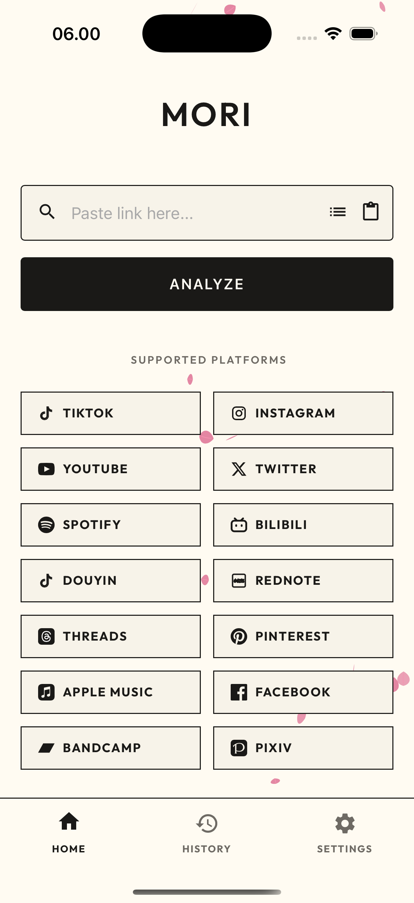
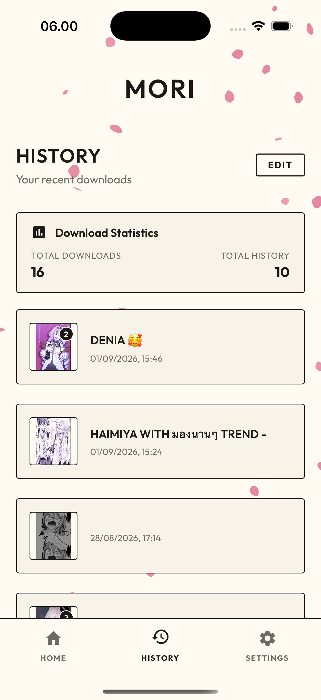
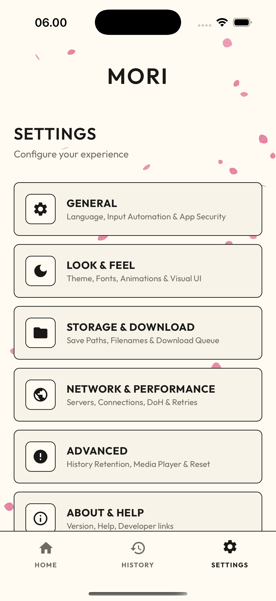
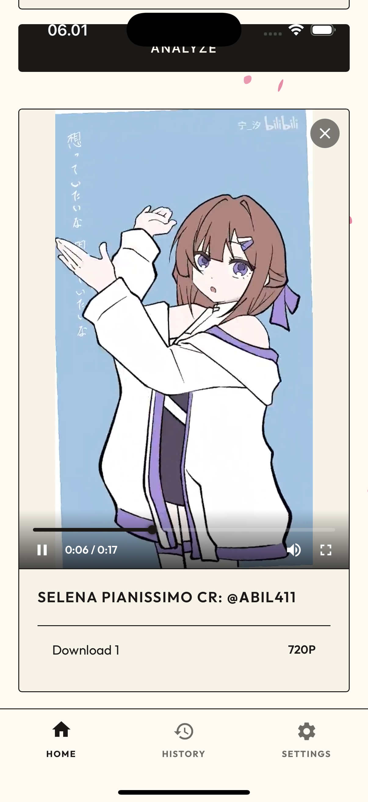
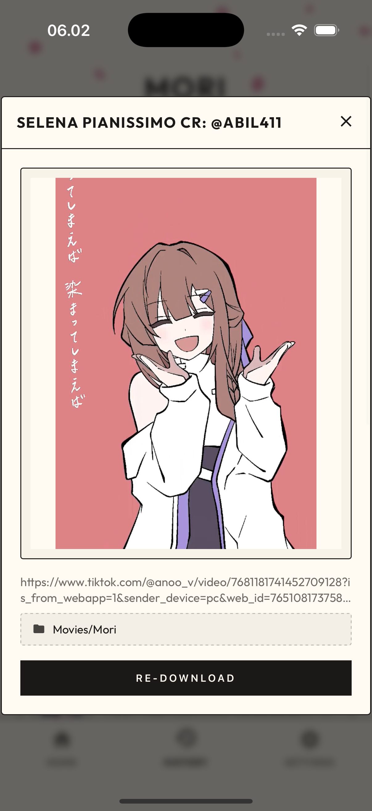
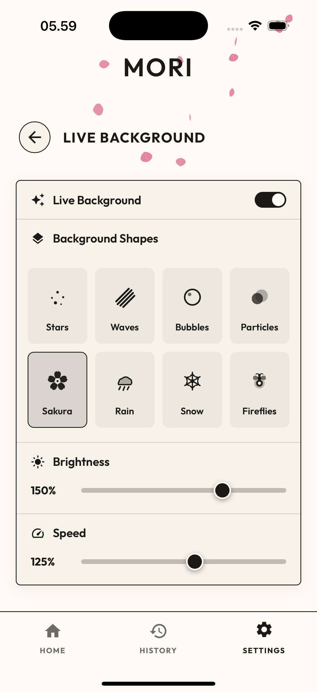

<p align="center">
  
</p>

<h1 align="center">Mori</h1>

<p align="center">
  
  
  
  
  
  
</p>

<div align="center">

Mori is a fast and simple downloader for saving videos, photos, and music from 14 popular social media apps. Everything works directly on your device without any external servers or tracking — giving you total privacy and zero ads.

</div>

## 📸 Screenshots

<p align="center">
  
  
  
</p>
<p align="center">
  
  
  
</p>

## What's New in v4.2.0

- **macOS & Windows Desktop Support (Tauri v2)**: Added native desktop application support for macOS (`.dmg`, `.app`) and Windows (`.exe`, `.msi`) powered by Tauri v2.
- **Native CORS-Free Desktop HTTP Engine**: Integrated native Rust HTTP client (`tauri_http_request` & `tauri_fetch_bytes` via `reqwest`) to handle cross-origin network requests and binary file streaming on Desktop, eliminating WebKit CORS blocks and header restriction errors (`Load failed`).
- **Native Desktop File Saving**: Implemented direct Rust disk writers (`tauri_download_file` & `tauri_save_bytes_file`), automatically saving downloaded media files and exported PDF galleries directly to the user's native Downloads folder (`~/Downloads/Mori/` on macOS, `C:\Users\<Username>\Downloads\Mori\` on Windows).
- **Desktop Native Browser Launcher & Auto-Update Engine**: Integrated native Rust URL process launcher (`tauri_open_url`) and semantic version comparison (`isNewerVersion`), ensuring "UPDATE" and "Report Bug" links launch directly in the user's default desktop browser (Safari/Chrome/Arc) without WKWebView pop-up blocks. Fixed `autoCheckUpdate()` and `checkUpdate()` on macOS Desktop by parsing Rust HTTP response objects (`res.data`).
- **Pixiv Ugoira Live MP4 Video Preview**: Fixed Pixiv Ugoira (animated illustration) preview playback on macOS/Windows Desktop. Integrated native Rust CORS-bypass streaming (`tauri_fetch_bytes`) with custom `Referer: https://www.pixiv.net/` headers to fetch and loop MP4 video animations smoothly inside the preview modal.
- **Cross-Platform PDF Gallery Exporter**: Resolved `undefined is not an object (evaluating 'CapacitorHttp.get')` and `CHROME_UA` reference errors during PDF generation on Desktop. Implemented cross-platform fetch fallbacks and native Rust file saving into the Mori folder on macOS and Windows.
- **Desktop Local Media & Audio Preview Player**: Integrated Rust binary file byte reader (`tauri_read_file_bytes`) with dynamic Blob URL stream generation (`blob:http://...`) and platform-aware path resolution in `ui.js` & `player.js`, eliminating macOS WebKit local file restrictions, Android legacy path overrides (`/storage/emulated/0/`), and HTML5 player `▶ Error` states for smooth video and MP3 audio playback in History.
- **Pinterest Dual-Server & PinDirect**: Pinterest now has two selectable servers — **Server 1 (PinDown)** for scraper-based downloads and **Server 2 (PinDirect)** for direct extraction from Pinterest HTML. Users can choose via the server selection dialog.
- **PinDown Image Classification Fix**: Fixed a bug where the PinDown scraper incorrectly classified image downloads as `VIDEO` type. Now only URLs ending with `.mp4` are marked as video, so image pins properly download as images.
- **Pinterest Multi-Image Support**: PinDirect mode extracts all available original-resolution images from a pin page, including gallery pins with multiple photos.
- **Spotify SoundLoaders Server Replacement**: Replaced the non-functional SpotMate server with **SoundLoaders** as Spotify Server 2. SoundLoaders integrates Turnstile challenge bypass via `/api/userverify` for reliable track downloads.
- **Android Storage Permission & `EACCES` Fix**: Resolved `Permission denied (EACCES)` errors on Android 13+ and restricted devices. Removed hard permission check aborts for deprecated `WRITE_EXTERNAL_STORAGE` and implemented an automatic multi-directory fallback chain (`EXTERNAL_STORAGE` → `DOCUMENTS` → `EXTERNAL`), ensuring downloads succeed seamlessly across all Android versions (Android 10-15).
- **Explicit Web Scraper Names in Server Selection Pop-ups**: Standardized the server selection modal text across all multi-server platforms (TikTok, Instagram, YouTube, Twitter, Spotify, Pinterest) to explicitly label each server with its official web scraper provider name (e.g. TikTokIO / SnapTik, InDown / DownReels, YTMP3.gg / YTMP3.mobi, TweeLoad / TVD, SpotiDown / SoundLoaders, PinDown / PinDirect).
- **Clean Filename Template Options & Default Setting**: Removed the redundant "Default" option and set **Title Only** (`title`) as the default filename template. Fixed a bug where filename options forcibly appended a 13-digit timestamp to downloaded files. "Title Only" now produces clean output (`Title.mp3`), while duplicate file collisions on disk automatically use clean incremental counters (`Title_1.mp3`, `Title_2.mp3`) across both Mobile and Desktop.
- **Desktop Biometric & Haptics Guard**: Implemented platform-aware guards for Privacy Lock and Haptics (`window.Capacitor?.isNativePlatform()`). Mobile biometric authentication (`@capgo/capacitor-native-biometric`) is preserved for Android and iOS, while Desktop platforms (macOS/Windows) automatically bypass mobile biometric checks and hide mobile lock and haptic settings to prevent navigation freezes or unhandled plugin exceptions.
- **Color Accent Setting Removed**: Removed the Color Accent dropdown setting from the UI to enforce Mori's minimal black-and-white design system.
- **SpotMate Removed**: The SpotMate scraper has been fully removed from the codebase.

## Previous Updates v4.1.0

- **Monotonic Floating Download Progress Toast & Zombie Timer Fix**: Refactored progress animation with strict monotonic state tracking (`updateProgress`) and global timer lifecycle management (`window._moriActiveSimInterval`), ensuring progress width never jumps or animates backwards during retries, errors, or subsequent download attempts.
- **Clean Single-Percentage UI**: Eliminated redundant percentage text from download action buttons and progress toast status footers. Clean percentage numbers are shown exclusively in the top-right progress toast badge (`.dpt-percent`).
- **Responsive Toast Error Formatting & Overflow Guard**: Sanitized long raw API URLs/tokens in error messages and added multi-line word-wrap CSS rules (`word-break: break-word; overflow-wrap: anywhere`) to prevent error text overflowing toast borders.
- **Silent Background Auto-Retry Engine**: Implemented seamless silent auto-retries for background network downloads. Retries occur silently in the background while holding the UI cleanly at 95% / `Downloading...`, eliminating status text flickering and progress bar jumps until successful completion or final error reporting.
- **Douyin Multi-Image Photo Slideshow Fix**: Resolved an issue where Douyin photo posts only displayed a single image in the preview. Re-aligned item type mapping (`PHOTO`) between `douyin.js` and `ui.js`, enabling full horizontal swipe navigation across all photos in Douyin slideshows.
- **Server Selection Backdrop Default (Server 1)**: Enhanced the server selection modal (`confirmOverlay._onDismissOutside`) so that if a user accidentally taps outside the modal box on the backdrop overlay, the app automatically defaults to **Server 1** to proceed smoothly without hanging.
- **Comprehensive Japanese Localization (`ja`)**: Fully localized all previously untranslated Settings menus, missing toggle labels (**Completion Sound / 完了通知音**, **Header Quote / ヘッダー名言**, **Home Greeting / ホーム挨拶**), custom select dropdown selected text re-hydration (**Default / デフォルト**, **15 Seconds / 15秒**, **Classic / クラシック**, **TEST / テスト**), and Scraper Health diagnostics.
- **Dynamic Device Platform Detection & Share App Fix**: Replaced hardcoded platform labels in `script.js` with dynamic `window.Capacitor?.getPlatform()` detection (`iOS`, `Android`, or `Web Browser`), ensuring accurate device diagnostics and bug reporting. Fixed duplicated repo links in `share-msg` across all 6 supported languages.
- **Static Thumbnail Image Preview for Analyzed Un-Downloaded History Items**: Updated `showModal` in `ui.js` so that items in History that have only been analyzed (not downloaded yet) display a clean static cover thumbnail image instead of initiating a network streaming video/audio player. Interactive media playback is reserved exclusively for locally saved downloaded files.
- **Fixed Local File Preview Resolution in History Modal**: Resolved a critical bug where the History detail modal would attempt to stream media from the network instead of playing locally saved files. The root cause was that `content://` URIs (returned by `Filesystem.getUri()`) were prioritized over the relative file path in both `ui.js` (`fileSrc` selection) and `player.js` (`cleanPath` resolution). Since WebView cannot properly handle `content://` schemas for media playback via `convertFileSrc`, playback silently failed and fell back to network streaming. Fixed by preferring `file.path` (relative path → `file://` → `_capacitor_file_`) in `showModal` and `videoUrl` (pre-converted `_capacitor_file_` URI) in `createVideoPlayer`.
- **Redesigned Monochrome History Edit Mode & Action Header**: Re-architected History edit controls into a clean inline header layout (`.history-actions-wrapper`) with strict monochrome black-and-white styling (`EDIT`, `CLEAR ALL`, `DONE`, `×`), eliminating colored accents to match Mori's minimal design system.
- **Modal Overlay State Fix (`confirmOverlay`)**: Resolved inline `style.display = "none"` state bugs triggered by scraper choice / cellular warning popups, ensuring `showConfirm()` explicitly sets `display = "flex"` so `CLEAR ALL` and individual delete confirmation modals remain 100% interactive before and after downloads.
- **Adaptive Real-Time Download Progress Toast**: Upgraded floating bottom progress toast with smooth adaptive dynamic scaling (0% to 85% during active transfer, jumping instantly to 100% upon disk write completion) and real-time byte tracking, eliminating the progress freeze/stuck state at 92% on chunked media streams.
- **Smart History Matcher (`mori_file_saved`)**: Enhanced `mori_file_saved` event listener to match history entries by `url`, `sourceUrl`, or fallback to the latest history item, ensuring `localFiles` and `localUri` references are ALWAYS saved into `mori_history` in `localStorage`.
- **Restored Android WebView Autoplay (`MainActivity.java`)**: Restored `settings.setMediaPlaybackRequiresUserGesture(false)` and `settings.setAllowFileAccess(true)` in `MainActivity.java`, enabling smooth programmatic autoplay of video previews in Android WebView.
- **Capacitor Local HTTP URL Protection**: Protected `http://localhost` internal webserver URLs (`_capacitor_file_`) in `player.js` from unintended HTTPS rewrites while strictly enforcing `https://` upgrades for all remote media streams (TikTok, Instagram, Bilibili, etc.), eliminating `ERR_CONNECTION_REFUSED` local preview errors.
- **Strict Monochrome Design Aesthetic**: Enforced a clean, premium black-and-white theme across all progress bars, latency diagnostic badges, edit controls, and toast notifications, eliminating noisy colored accents for visual consistency.
- **Modular Scraper Suite Architecture (1-to-1 Platform Files)**: Deconstructed the monolithic `scrapers.js` (2,300+ lines) into clean, standalone ES modules inside `public/js/scrapers/`. Every platform has its dedicated scraper file (`tiktok.js`, `youtube.js`, `instagram.js`, `twitter.js`, `spotify.js`, `bilibili.js`, `pixiv.js`, `rednote.js`, `douyin.js`, `threads.js`, `pinterest.js`, `applemusic.js`, `facebook.js`, `bandcamp.js`), unified via `index.js` barrel export.
- **Domain Application Managers**: Separated core app logic into dedicated manager modules (`authManager.js`, `historyManager.js`, `settingsManager.js`, `downloadManager.js`).
- **Clean Subdirectory Project Structure**: Reorganized loose root JavaScript files into clear subdirectories (`public/js/vendor/`, `public/js/components/`, `public/js/i18n/`, `public/js/utils/`).
- **Centralized HTTP Client & Defensive Response Parsing**: Extracted all HTTP network logic into a unified `scraperFetch` helper (`httpHelper.js`), automatically injecting active User-Agent presets, respecting custom request timeout limits, and defensively parsing HTML error pages (Cloudflare/Rate Limit blocks).
- **Unified URL Extraction & Sanitization Engine**: Consolidated URL extraction and parameter stripping into `urlUtils.js`, standardizing protocol normalization (`https://`) and tracking parameter removal (`utm_*`, `igsh`, `s`, `t`, `si`) across all 14 platform scrapers.
- **Redesigned Focused-Input Toast & Universal Settings Notifications**: Upgraded `.custom-toast` to mimic the focused URL input style (`1.5px solid var(--primary)` border with `4px 4px 0px var(--primary)` shadow and `105px` clearance above bottom nav), with haptic feedback vibration and localized toast notifications across all 30+ settings controls in English, Indonesian, Japanese, Spanish, Chinese, and Russian.
- **Mobile Hardware Back Button & Double-Tap Exit Guard**: Integrated native Android back button event listener to dismiss open modals/subpages, navigate back to Home, and require double-tap back within 2 seconds to exit the app.
- **Pixel-Perfect Settings UI Layout Polish**: Standardized Network & Performance settings dropdown row heights (`38px` fixed height) and truncated text labels to prevent multi-line text wrapping.
- **New "Scraper Engine & Status" Settings Sub-Page**: Added a dedicated 6th settings sub-page allowing users to monitor real-time online/offline server health, active API engines, and round-trip response latency (ms) across all 14 supported platform scrapers. Features a clean, justified 2-column card layout displaying server endpoints (e.g. SnapTik, TikTokIO) with their respective latency badges (ms) positioned directly below each server title (Douyin moved after Spotify, filler words like "Engine/Extractor" removed).
- **Enhanced Memory & Canvas Resource Cleanup**: Upgraded `getVideoThumbnail` with a centralized resource cleanup engine that revokes Object URLs (`blob:`), unbinds media event listeners, and resets `<canvas>` dimensions immediately upon completion or error.

## Supported Platforms

| Platform                                                                                                                                                              | Features               | Platform                                                                            | Features                             |
| :-------------------------------------------------------------------------------------------------------------------------------------------------------------------- | :--------------------- | :---------------------------------------------------------------------------------- | :----------------------------------- |
|  **TikTok**                                                                                         | Video (No WM) / Photos |  **Instagram** | Reels / Stories / Photos             |
|  **YouTube**                                                                                       | MP4 Video / MP3 Audio  |  **Twitter (X)**       | HD Video / GIFs                      |
|  **Spotify**                                                                                       | MP3 Audio              |  **Pinterest** | PinDown & PinDirect (Video / Images) |
|  **Apple Music**                                                                                | MP3 Audio              |  **Facebook**   | Reels / HD Video                     |
|  **RedNote**                                                                                   | Photos / Videos        |  **Threads**     | Video / Photos                       |
|  **Bilibili**                                                                                     | Video / Audio (DASH)   |  **Pixiv**         | Gallery / Ugoira to MP4              |
|  **Douyin** | Video (No WM) / Photos |  **Bandcamp**   | Album / MP3 Track                    |

## Built With

- **JavaScript (ES6+)**: Core application logic and scraping engine.
- **HTML5 & CSS3**: Custom design system without bloated frameworks.
- **Tauri v2**: Ultra-lightweight desktop engine for macOS & Windows (.dmg, .app, .msi, .exe).
- **CapacitorJS**: Native Android and iOS bridge for filesystem, share sheet, clipboard, and biometrics.
- **pdf-lib**: Client-side PDF generation and bundling.

## Project Structure

```
Mori/
├── android/                    # Capacitor Android native project
│   ├── app/src/main/           # Android manifest, resources, assets
│   └── gradle/                 # Gradle wrapper & build config
├── ios/                        # Capacitor iOS Xcode workspace
│   └── App/                    # iOS Xcode project, Info.plist, and Pods
├── src-tauri/                  # Tauri v2 Desktop Rust backend & configuration
│   ├── capabilities/           # Application capabilities & permissions
│   ├── src/                    # Rust native HTTP & file commands (tauri_http_request, tauri_download_file)
│   └── tauri.conf.json         # Desktop configuration & window bounds
├── assets/                     # Screenshots & branding assets
├── public/
│   ├── css/
│   │   └── style.css           # Design system & all component styles
│   ├── js/
│   │   ├── components/         # Custom UI components (MoriPlayer)
│   │   │   └── player.js
│   │   ├── i18n/               # Multi-language translations (EN/ID/JA/ES/ZH/RU)
│   │   │   └── index.js
│   │   ├── modules/            # App managers (auth, history, settings, download)
│   │   │   ├── authManager.js
│   │   │   ├── downloadManager.js
│   │   │   ├── historyManager.js
│   │   │   └── settingsManager.js
│   │   ├── scrapers/           # Standalone scraper modules (14 platforms)
│   │   │   ├── applemusic.js
│   │   │   ├── bandcamp.js
│   │   │   ├── bilibili.js
│   │   │   ├── douyin.js
│   │   │   ├── facebook.js
│   │   │   ├── httpHelper.js
│   │   │   ├── index.js
│   │   │   ├── instagram.js
│   │   │   ├── pinterest.js
│   │   │   ├── pixiv.js
│   │   │   ├── rednote.js
│   │   │   ├── spotify.js
│   │   │   ├── threads.js
│   │   │   ├── tiktok.js
│   │   │   ├── twitter.js
│   │   │   └── youtube.js
│   │   ├── utils/              # Helpers, URL sanitization & scraper health
│   │   │   ├── index.js
│   │   │   ├── scraperHealth.js
│   │   │   └── urlUtils.js
│   │   ├── vendor/             # Third-party libraries (pdf-lib)
│   │   │   └── pdf-lib.min.js
│   │   ├── script.js           # Core application init & lifecycle
│   │   └── ui.js               # Media slider, results UI, and rendering logic
│   └── index.html              # Single-page application entry point
├── capacitor.config.json       # Capacitor configuration
├── package.json                # Dependencies & scripts
├── .gitignore
├── LICENSE
└── README.md
```

## Key Features

- **Multi-Platform Support**: High-quality downloads from TikTok (No Watermark, HD Video, MP3 & Photo Slideshows), Instagram (Reels/Posts/Photos), YouTube, Twitter (X), Spotify, Pinterest, Apple Music, Facebook, **Threads**, **Bandcamp**, **Pixiv** (R-18/R-18G), **Bilibili** (DASH), **Douyin** (No WM), and **RedNote (Xiaohongshu)**.
- **Live Media Previews**: View images, play videos, and listen to audio directly within the app before downloading.
- **Standalone PDF Document Export**: Convert image galleries from any platform into high-quality PDF files for offline viewing.
- **Private History Manager**: Downloaded files are managed internally with local playback support and offline badge detection.
- **Share Intent Integration**: Send links directly to Mori from other apps via the system Share menu.
- **Auto Clipboard Paste**: Automatically detects and pastes links from clipboard when you return to the app.
- **Auto Update Check**: Checks for new versions on startup via GitHub Releases and shows a popup modal when an update is available.
- **Hardened Biometric Privacy Lock**: Secure your history and settings menu with native fingerprint, FaceID, or TouchID authentication, featuring automatic background re-locking.
- **Multi-Language Support**: Fully localized in English, Indonesian, and Japanese (`en`, `id`, `ja`).
- **Export/Import Data**: Full data portability — backup and restore your history, settings, and paths as a JSON file.
- **Intelligent Error Handling**: Real-time feedback for IP blocks, API format changes, or network issues via premium Toast notifications.
- **Premium Minimalist UI**: A distraction-free glassmorphism interface with smooth transitions, dark mode, and accent colors.

## Security & Safety Notice

Mori is **100% open-source, ad-free, and contains zero malware, spyware, or trackers**. All network requests and file downloads run locally on your device without external analytics servers.

> [!TIP]
> **Doubtful or concerned about false-positive security warnings?**  
> Because Mori release binaries (`.apk`, `.dmg`, `.exe`, `.ipa`) are open-source builds compiled without expensive commercial enterprise signing certificates, some security software or browsers may display standard false-positive warnings.  
> If you have any doubts, you can upload and scan any release file directly on **[VirusTotal](https://www.virustotal.com/)** before installing!

## How to Use

1. Copy a link from a supported platform or Share it directly to Mori.
2. Use the **Paste** button or let the auto-detection handle the link.
3. Tap **Analyze** to verify the content.
4. Preview the media (swipe through carousels if available).
5. Choose your format and tap **Download**.
6. Files are saved to your internal history for offline access.

## For Developers

Mori is built using Capacitor and Vanilla JS for high performance.

- **On Android & iOS**: Uses `CapacitorHttp` to bypass CORS and download directly from the device IP. Files are saved to local device storage and accessible via the **Files app** (`On My iPhone/Mori`) on iOS.
- **On Web**: Preview mode only — runs directly in the browser with limited functionality.

### Building the APK

```bash
# 1. Sync Capacitor with Android
npx cap sync android

# 2. Build the debug APK
cd android && ./gradlew assembleDebug

# 3. The APK is output at:
#    android/app/build/outputs/apk/debug/Mori v{VERSION}.apk
```

For a release APK, first generate a signing keystore (one-time):

```bash
keytool -genkey -v -keystore android/app/release.keystore -alias mori \
  -keyalg RSA -keysize 2048 -validity 10000 \
  -storepass android123 -keypass android123 \
  -dname "CN=Mori, OU=Development, O=MoriApp, L=Unknown, ST=Unknown, C=ID"
```

Then add `signingConfigs` block to `android/app/build.gradle`:

```groovy
android {
    signingConfigs {
        release {
            storeFile file('release.keystore')
            storePassword 'android123'
            keyAlias 'mori'
            keyPassword 'android123'
        }
    }
    buildTypes {
        release {
            signingConfig signingConfigs.release
            // ...
        }
    }
}
```

Build the signed release APK:

```bash
cd android && ./gradlew assembleRelease
```

Output at: `android/app/build/outputs/apk/release/Mori v{VERSION}.apk`

### Running & Building for Desktop (macOS & Windows)

Mori uses **Tauri v2** for lightweight, high-performance desktop apps on macOS (.dmg, .app) and Windows (.msi, .exe).

#### Development Mode

```bash
npm run tauri:dev
```

#### Building Release Installers

```bash
npm run tauri:build
```

- **macOS Output**: `src-tauri/target/release/bundle/dmg/Mori_4.2.0_aarch64.dmg` & `Mori.app`
- **Windows Output**: `src-tauri/target/release/bundle/msi/Mori_4.2.0_x64_en-US.msi` & `.exe`

### Running & Building for iOS

#### Running on Simulator or Device

```bash
# 1. Sync web assets & iOS CocoaPods dependencies
npx cap sync ios

# 2. Open the Xcode workspace
npx cap open ios

# 3. Select target (iPhone Simulator or connected iOS device) and press Run (Cmd + R)
```

#### Building Unsigned IPA (For Sideloading/Distribution)

If you do not have an iPhone connected or a paid Apple Developer Account, you can build a generic unsigned `.ipa` for distribution via the command line:

```bash
# 1. Sync assets
npx cap sync ios

# 2. Compile target for generic iOS device without code signing
xcodebuild -workspace ios/App/App.xcworkspace -scheme App -configuration Release -sdk iphoneos -archivePath build/Mori.xcarchive archive CODE_SIGNING_ALLOWED=NO

# 3. Package compiled app bundle into a Payload folder and Zip to IPA
mkdir -p Payload && cp -r build/Mori.xcarchive/Products/Applications/App.app Payload/ && zip -r "Mori v4.2.0.ipa" Payload && rm -rf Payload build
```

This outputs `Mori v4.2.0.ipa` in your project root directory, ready to be sideloaded via AltStore, Sideloadly, Scarlet, or TrollStore.

## iOS Sideloading Guide

Since Mori is client-side only and not distributed on the Apple App Store, iOS users can install `Mori v4.2.0.ipa` using one of the following sideloading methods:

- **AltStore / Sideloadly**: Best for all iOS versions. Requires a PC/Mac for initial installation, and app signatures need to be refreshed every 7 days (free personal Apple ID).
- **TrollStore**: Best for compatible iOS versions. Installs permanently, requires no computer after setup, and does not expire.
- **Scarlet / Esign**: Directly install on-device without a PC using enterprise/public developer certificates.

---

Developed with ❤️ by coflyn.
GitHub: https://github.com/coflyn
Instagram: @\_coflyn

## License

Mori is released under the **MIT License**. Feel free to use, modify, and distribute it.
